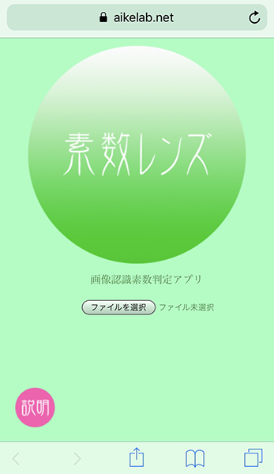

素数レンズ
===

## Description
画像認識素数判定アプリ

スマホで撮影した画像に素数が含まれるか判定するアプリ。  

正しく判定できる最大値は9007199254740991（Number.MAX_SAFE_INTEGER）、素数判定はこちらのcheck-primeを使っています。シンプルな試し割り法ですが、いくつか試した中で今回の用途にはもっとも安定していて速度も十分でした。  
https://github.com/vikramcse/check-prime

## Website
https://aikelab.net/primelens/

## Credit
Copyright(c) 2018 aike (@aike1000)  
Released under the MIT License
